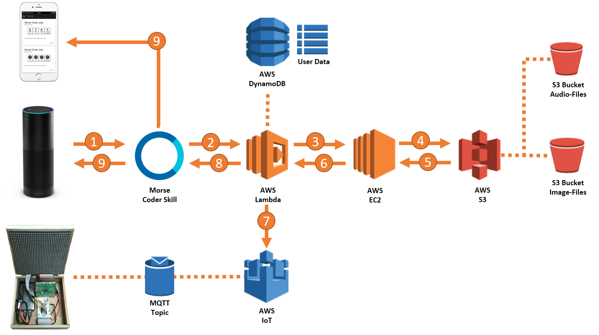

## Alexa Morse-Coder Skill

This skill is both - a fun skill with lots of features for the Morse-Coder community as well
as reference implementation for [Alexa Tellask SDK](https://github.com/KayLerch/alexa-skills-kit-tellask-java)
and [Alexa States SDK](https://github.com/KayLerch/alexa-skills-kit-states-java).

### User features
* __Encode first names__ : Say "Encode" followed by a given name of your choice and Alexa
plays back the name in Morse-Code.
* __Morse exercises__ : Alexa tests your Morse comprehension skill by playing back Morse
codes of random words and asks you to decode and say the word.
* __Letter cards__ : Whenever a Morse-code is played back on the Echo an image is returned
in the Alexa app showing letter-cards you can use to solve an exercise or to improve your
comprehension.
* __Highscores__ : Completed exercises gets you points resulting in your personal score.
Earned points depend on length of a word, playback speed and number of retries. The highest
score among all users will be obtained and rewarded by Alexa.
* __Adjust playback speed__ : The speed a Morse code is played back in all of the aforementioned
features can be adjusted. Speed of Morse code is measured in words per minute (wpm). The skill
allows any speed in between 9 and 30 wpm. "_Speed up_", "_Slow down_" or "Set speed to twenty
words per minute_" are typical utterances to alter speed.
* __Farnsworth mode__ : Farnsworth can be enabled when Alexa plays back Morse code. Farnsworth
puts longer pauses between the single signs in a code with reducing the wpm of the spaces by 7.
* __Permanent settings__ : Playback speed, Farnsworth mode, Personal score and some other settings
made by the user will be saved by the skill so they are still available on the user's next session.
* __Multi-language support__ : The skill is available in German, American and British English.
* __Multivariant speech__ : Alexa has a lot of ways to express herself and to
provide the same information with different response utterances. It never gets boring to communicate
with Alexa over this skill.
* __Device integration__ : It is a hidden feature to demonstrate how to easily integrate IoT
 devices like the Raspberry-Pi-powered Lightbox - returning a Morse-code as light-signals.

### Technical solution

The skill relies on several AWS cloud services.
#####AWS Lambda
A Lambda function handles all incoming speechlet requests. It also receives the _locale_ on
each request so it returns speech in the corresponding language.
#####AWS DynamoDB
This NoSQL database stores information about settings and score of all users. To optimize performance
the Lambda function caches static information in the Alexa session which persists throughout a single
user session. All information which is persisted either permanently or temporarily is referred to
as _state_. [Alexa States SDK](https://github.com/KayLerch/alexa-skills-kit-states-java) makes it easy
to hold this state in Java POJOs and manages their state with _AlexaStateHandler_s which hide most of
the complexity on reading/writing to/from data stores like DynamoDB or S3. In this case _AWSDynamoStateHandler_
is leveraged to manage permanent state in a DynamoDB table.
#####AWS EC2
This skill also relies on a Spring Boot Java application which is accessed by the Lambda function through a REST over HTTP interface.
EC2 is the virtual instance this application is hosted. The REST-API takes an exercise word and generates
the Morse-code on-the-fly. The result is an MP3-file it stores in an S3 bucket and two images (the letter cards
for the Alexa app). The URLs of those files is returned to the Lambda function.
#####AWS IoT
If the user enabled the device integration feature this skill creates a user-specific thing shadow
in AWS IoT. By updating the shadow state with the encoding information of an ongoing exercise,
an MQTT message is propagated to a topic IoT devices are subscribed to.